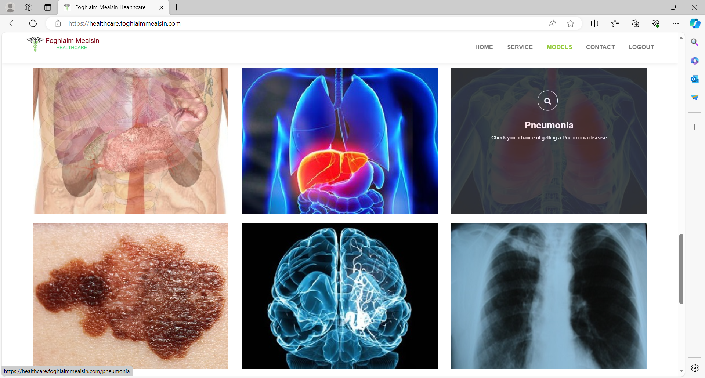
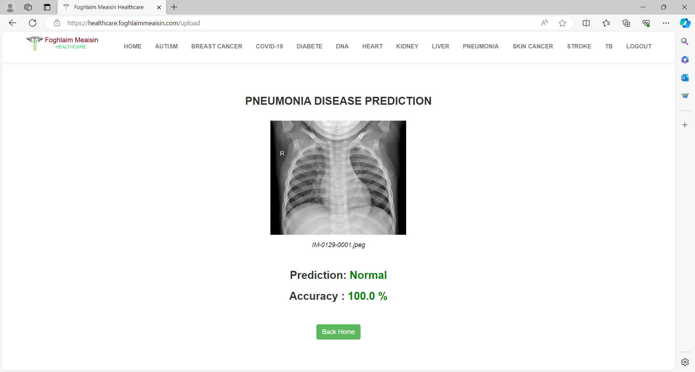
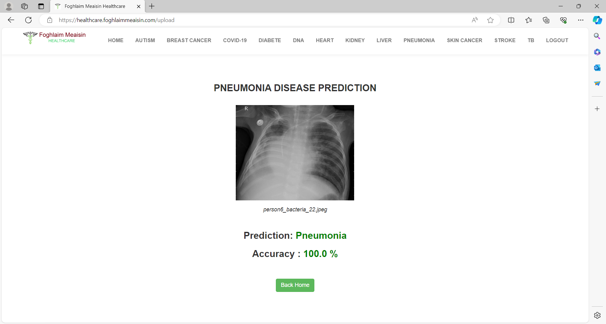
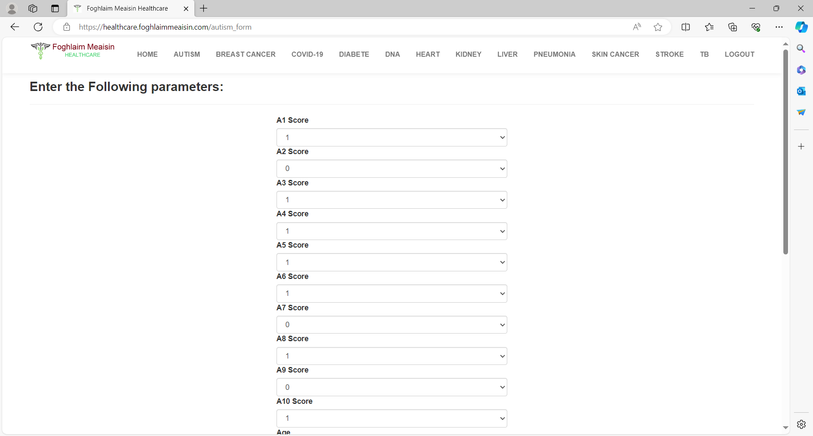
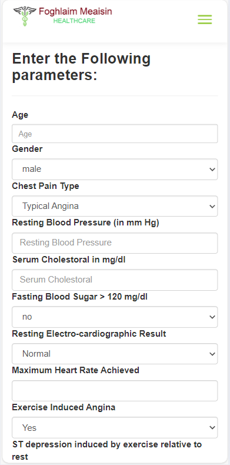

<h1>Online Healthcare System for Sales on AWS</h1>

We are Mekong IT Services, an IT organization (company) established in Calgary, Alberta, Canada.
 
We have new research on Medical Machine Learning to find precious clients who are medical doctors and clinics and who are interested in our Automatic Medical Diagnosis software online, called the "Mekong Health" software.
 
<h2>These are our software accuracy on disease prediction</h2>
 
I) Autistic Spectrum Disorder of Children

Prediction Accuracy: 97%
 
II) Breast Cancer

Prediction Accuracy: 98%
 
III) Diabetes

Prediction Accuracy: 86%
 
IV) DNA Genetic Disorder

Prediction Accuracy: 96%
 
V) Heart Disease

Prediction Accuracy: 90%
 
VI) Kidney Disease

Prediction Accuracy: 98%
 
VII) Liver Disease

Prediction Accuracy: 84%
 
VIII) Pneumonia

Prediction Accuracy: 94%
 
IX) Stroke

Prediction Accuracy: 81%
 
<h2>Result 1:  Let us have a look of how we perform Pneumonia predictions through a few screenshots</h2>
 
A) On our Home page (after User Login)


 
B) We select Pneumonia


 
C) We then upload the first healthy X-ray and obtain Normal condition


 
D) Otherwise we can also upload the second sick X-ray and obtain Pneumonia Disease condition
 

 
<h2>Result 2: Let us have a look of how we perform an Autistic Spectrum Disorder of Children prediction through a few screenshots</h2>
 
A) On our Home page (after User Login), we select Autistic Spectrum Disorder of Children


B) We then fill in the dimensions




C) We then get the result of Autism prediction


Our software can beautifully launch on your mobile cell phones any where, easily only requiring that you have a Wifi connection.

This is how it looks on your iPhone


This is how it looks on your Samsung
 

 
This software is very useful for Medical Researches and for Trainings both for Medical Studies and Computer Science.

<h1>How to run this project</h1>

<h2>Install requirements</h2>

```sh
pip install -r requirements.txt
```

## Database Used
- Postgresql

<h2>Run this command to start local server: </h2>

```sh
python healthcare.py
```

COPYRIGHT@2023 OF MEKONG IT SERVICES, CALGARY, ALBERTA, CANADA.
